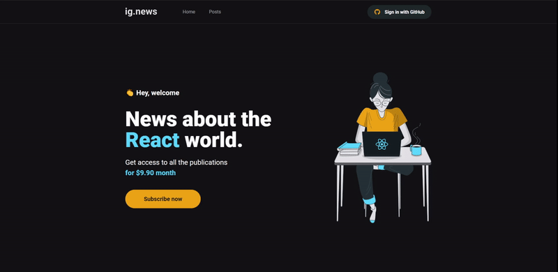

# [Ignews](https://ignews-steel.vercel.app/)
     

<p align="center">
  
</p>


* [Content (en-US)](#section-en_us)
* [Conteúdo (pt-BR)](#secao-pt_br)

---

## About the project <a id="section-en_us"></a>

Ignews is a subscription blog service, where the user can subscribe and read the posts created. If users are not subscribers, they can see the summary of posts when they login through their account, but will be redirected to the home screen if they are not logged in. The project was made using the React Next.JS framework, using Stripe's payments API and the FaunaDB database to manage user subscriptions, in addition to the Prismic CMS service to create blog posts.

## Content
  * [Techs](#techs)
  * [How to run the project](#installation)
    * [Installation - Frontend](#installation-front)

## Techs <a id="techs"></a>

- [x] NextJS
- [x] Stripe
- [x] FaunaDB
- [x] Prismic

## How to execute the project <a id="installation"></a>
To execute the project, you'll need to have Node and NPM or Yarn installed to setup all the dependencies.


### Installation - Front-end (Web) <a id="installation-front"></a>

In the project root folder:

```bash
npm install
npm run start
```

If you are using Yarn, use this:
```bash
yarn install
yarn start
```

Remember to create a .env file to put the enviroment variables exemplified in the .env.example file with your personal data.

After finishing installation, the web page will be open in your browser.

---

## Sobre o projeto <a id="secao-pt_br"></a>

Ignews é um serviço de blog por assinatura, onde o usuário pode realizar sua assinatura e ler os posts criados. Caso os usuário não sejam assinantes, eles podem ver o resumo dos posts quando acessar através da sua conta, mas será redirecionado para a tela inicial caso não tenha login. O projeto foi feito utilizando a framework React Next.JS, utilizando a API de pagamentos do Stripe e o banco de dados FaunaDB para gerenciar as assinaturas dos usuários, além do serviço de CMS Prismic para criar os posts do blog.

## Conteúdos
  * [Tecnologias](#tecnlogias)
  * [Como executar o projeto](#instalacao)
    * [Instalação - Front-end](#instalacao-front)

## Tecnologias <a id="tecnologias"></a>

- [x] NextJS
- [x] Stripe
- [x] FaunaDB
- [x] Prismic

## Como executar o projeto <a id="instalacao"></a>
Para executar o projeto, você irá precisar ter o Node e o NPM ou Yarn instalados para baixar as dependências.


### Instalação - Front-end (Web) <a id="instalacao-front"></a>

Na pasta raíz do repositório:

```bash
npm install
npm run dev
```

Se estiver usando Yarn, utilize
```bash
yarn install
yarn dev
```

Lembre-se de criar um arquivo .env para colocar as variáveis de ambiente exemplificadas no arquivo .env.example com os seus dados pessoais.

Quando terminar, a página da aplicação web será aberta no navegador.

---
###### Developed by [Gean Lucas](https://www.linkedin.com/in/geanlucaas/) :rocket:.